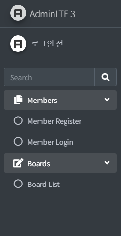
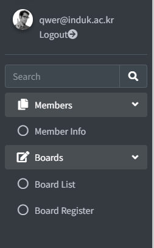
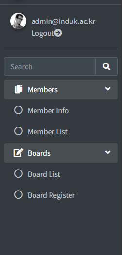
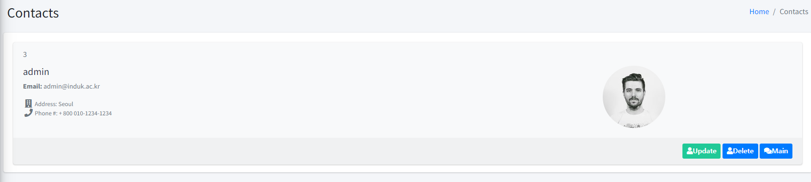
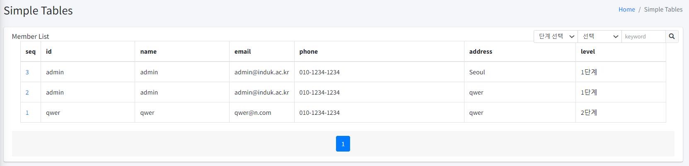
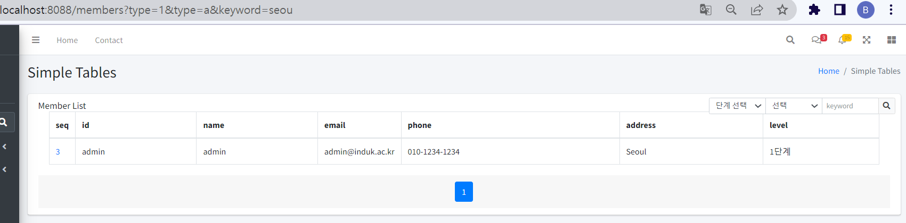
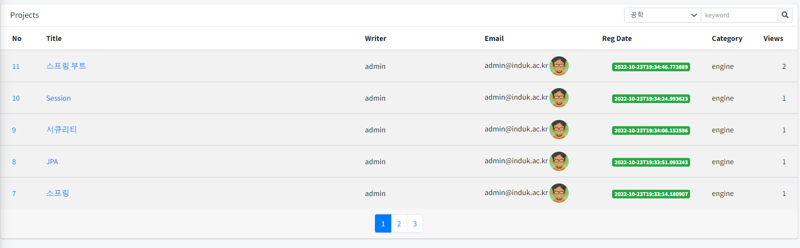
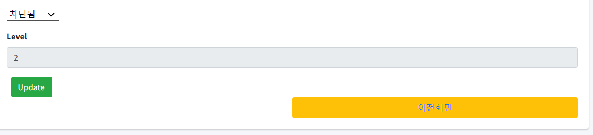
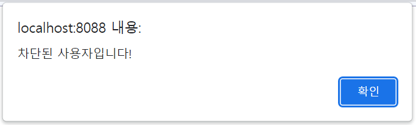
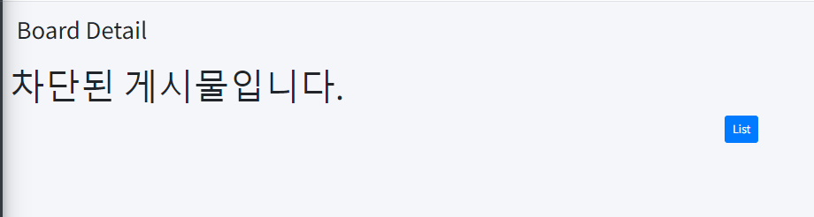

## 학기말 프로젝트

### 개요
> 회원제 게시판을 통해서 클라이언트와 서버의 요청 흐름을 Service/Repository 계층을 이해하고,
 JPA를 이용하여 DTO/Entity로 분리해 영속 객체의 생명주기를 효율적으로 관리하는 법을 배운 프로젝트입니다.
> 
> Querydsl을 이용하여 JPA에서의 한정적인 쿼리 작업에서 벗어나, 동적인 쿼리 작성의 이점을 실감할 수 있었습니다.
> 
> 또한, MyBatis와 다르게, SQL 쿼리를 코드로 작성함으로써, 컴파일 시점에 문법 오류를 쉽게 잡을 수 있다는 것을 배웠습니다.

### 기능
#### 세션을 통한 회원제 게시판
- 기본적인 회원 가입/로그인, 이를 이용한 게시글 CRUD 기능
- 관리자와 일반 사용자 분리
  - 회원 목록
    - 회원 단계 혹은 주소, 전화번호, 이름을 통한 검색
  - 회원 차단 및 그에 따른 게시글 차단
- 게시글 
  - 게시글 조회수 처리
  - 목록(페이지네이션)처리
  - 카테고리별 분류 기능
  
### 기술 스택
- IntelliJ IDEA
- JDK 11
- Gradle 7.4.1
- Spring Boot 2.6.8
  - Boot Starter
    - Data JPA
      - Querydsl 5.0.0
- Thymeleaf 3.0.15

### 로그인 전 메뉴창

### 회원 로그인 시 메뉴창

### 회원 로그인 시 (관리자)
#### 일반 회원과는 다르게 회원 목록을 볼 수 있습니다.

### 회원 상세 정보

### 회원 목록(관리자 상태)

### 회원 검색

### 게시글 목록 (카테고리 검색 시)

### 게시글 상세보기

### 회원 차단

#### 차단 설정

#### 차단된 사용자 (페이지 넘어갈 때마다 경고 발생)

#### 차단된 사용자의 게시물
